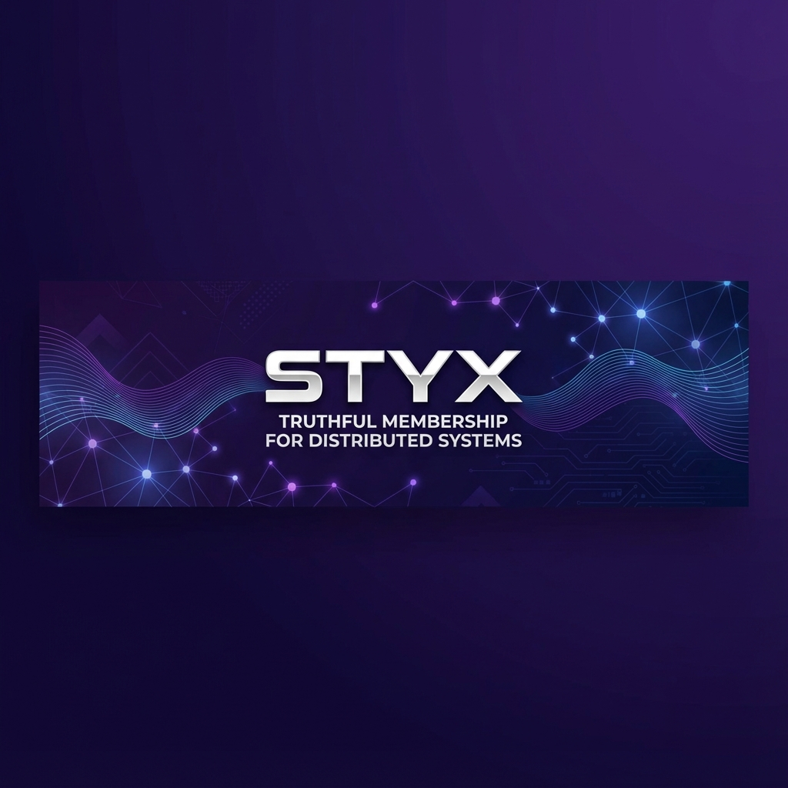

<p align="center">
  
</p>

<p align="center">
  
</p>

<h1 align="center">STYX</h1>

<p align="center">
  <strong>truthful membership for distributed systems</strong>
</p>

<p align="center">
  not logs. not heartbeats. not guesses. honesty.
</p>

---

## what it is

styx is a distributed membership system that refuses to lie.

it answers one question: who is alive and how sure are we

most systems answer this with timeouts heartbeats gossip and boolean flags. all of those lie under load partitions and reality.

styx does not.

if styx is unsure it says unknown.
if styx declares death its irreversible.
if styx cant answer honestly it refuses to answer.

## architecture

```
┌─────────────────────────────────────────────────────────────────┐
│                         STYX ORACLE                             │
│  ┌──────────────────────────────────────────────────────────┐   │
│  │                      HTTP API                             │   │
│  │   /query   /report   /health   /witnesses                │   │
│  └──────────────────────────────────────────────────────────┘   │
│                              │                                   │
│  ┌───────────────────────────┴───────────────────────────┐      │
│  │                    ORACLE CORE                         │      │
│  │  - Query with confidence requirements                  │      │
│  │  - Refusal mode when uncertain                        │      │
│  │  - Integrates all subsystems                          │      │
│  └───────────────────────────────────────────────────────┘      │
│           │              │              │              │         │
│  ┌────────┴───┐  ┌───────┴───┐  ┌───────┴───┐  ┌───────┴───┐   │
│  │  OBSERVER  │  │  WITNESS  │  │ FINALITY  │  │ PARTITION │   │
│  │            │  │           │  │           │  │           │   │
│  │ - Probing  │  │ - Trust   │  │ - Death   │  │ - Split   │   │
│  │ - Jitter   │  │ - Decay   │  │ - P13/14  │  │ - Refuse  │   │
│  │ - Entropy  │  │ - P10/11  │  │ - P15     │  │           │   │
│  └────────────┘  └───────────┘  └───────────┘  └───────────┘   │
│                              │                                   │
│  ┌───────────────────────────┴───────────────────────────┐      │
│  │                    FOUNDATION                          │      │
│  │  types: NodeID, Confidence, Belief                    │      │
│  │  time: LogicalTimestamp                               │      │
│  │  evidence: Evidence, EvidenceSet                      │      │
│  │  state: LocalBelief, ObserverState                    │      │
│  └───────────────────────────────────────────────────────┘      │
└─────────────────────────────────────────────────────────────────┘

                    BELIEF DISTRIBUTION
                    ┌─────────────────┐
                    │  alive: 0.61   │
                    │  dead:  0.19   │
                    │  unknown: 0.20 │
                    └─────────────────┘
                    (always sums to 1.0)
```

## what it is not

not a monitoring tool
not a heartbeat service
not raft or paxos or quorum based
not fast
not convenient

styx optimizes for truth not usability.

## core principles

uncertainty is first class
false death is worse then delayed death
silence is better then lies
disagreement is preserved
time is not trusted
death is irreversible

## packages

| package | what it does |
|---------|--------------|
| types | nodeid confidence belief |
| time | logical timestamps |
| evidence | evidence types and aggregation |
| state | local belief state machine |
| observer | single observer probing with jitter |
| witness | multi witness aggregation and trust |
| finality | irreversible death declaration |
| partition | network split detection |
| oracle | main api that ties it all together |
| api | http server |
| chaos | stress tests |

## quick start

```bash
# run server
go run cmd/styx-server/main.go

# query a node
curl "http://localhost:8080/query?target=42"

# submit witness report
curl -X POST http://localhost:8080/report \
  -H "Content-Type: application/json" \
  -d '{"witness": 10, "target": 42, "alive": 0.8, "dead": 0.1, "unknown": 0.1}'
```

## api shape

```go
result := oracle.Query(targetNode)

// result contains:
// - Belief (alive/dead/unknown distribution)
// - Refused (bool - true if oracle cant answer honestly)
// - RefusalReason (string)
// - Dead (bool - true if finality declared)
// - WitnessCount
// - Disagreement
// - PartitionState
// - Evidence (list of reasons)
```

there is no isAlive(node) returning true or false.

## implementation status

all phases done:
- phase 1: foundation (types beliefs evidence)
- phase 2: single observer (jitter tracking)
- phase 3: multi witness (trust decay disagreement)
- phase 4: finality engine (irreversible death)
- phase 5: partition awareness (split reality)
- phase 6: oracle api (main interface)
- chaos testing: all 8 stress tests passed

## properties that must hold

| num | property | status |
|-----|----------|--------|
| 1 | identity uniqueness | done |
| 3 | restart not equals resurrection | done |
| 4 | no evidence means no conclusion | done |
| 5 | evidence is monotonic | done |
| 6 | load not equals failure | done |
| 7 | belief is never binary | done |
| 8 | unknown always allowed | done |
| 9 | conflict widens belief | done |
| 10 | disagreement preserved | done |
| 11 | correlated witnesses weaken confidence | done |
| 12 | witness trust decays | done |
| 13 | false death forbidden | done |
| 14 | finality irreversible | done |
| 15 | silence not equals death | done |
| 18 | confidence sums to 1 | done |

## run tests

```bash
# all tests
go test ./... -v

# chaos tests
go test ./chaos/... -v
```

## license

MIT
